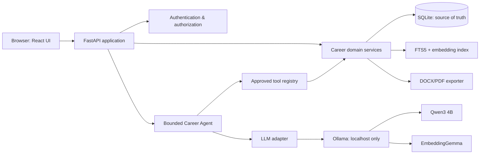

# Career Vault — Local-First MVP Architecture

## 1. Product decision

Build a **local-first, multi-user-ready, agent-assisted** career platform. It keeps a verified Career Vault for each user, compares it with a target job description, identifies evidence and gaps, and produces an ATS-friendly resume draft.

The MVP runs entirely on one MacBook. It uses local models only and exposes the app on `localhost`; no career information is sent to a cloud service.

### Non-negotiable rules

- The system must not invent employment, skills, certificates, metrics, or projects.
- Each resume claim must trace back to user-approved evidence.
- A user approves a resume before export.
- Users can access only records they own.
- The design must permit later replacement of local services with cloud equivalents.

## 2. Scope

### Included in the MVP

1. Local sign-in for 3–4 trusted test users.
2. Career Vault: employment, projects, contributions, skills, certificates, and user-confirmed evidence.
3. Guided Career Interview chatbot that captures detailed information over multiple conversations.
4. Job description paste and requirement analysis.
5. Evidence retrieval and requirement-to-evidence matching.
6. Readiness report: strong matches, partial matches, learnable gaps, critical gaps.
7. Tailored, editable resume draft and PDF/DOCX export.
8. Bounded Career Agent that guides approved tools.
9. Per-run audit history and evidence traceability.

### Explicitly deferred

- PDF/DOCX resume upload, parsing, and text extraction. The MVP gathers richer information through conversation instead.
- Public internet hosting and external sign-up.
- Job-board scraping or auto-applying to jobs.
- Mobile application.
- Payments, subscriptions, and enterprise SSO.
- Multiple autonomous agents or self-improving agents.
- Dedicated vector database, Kubernetes, Docker, and cloud infrastructure.

## 3. Technology choices

| Concern | MVP choice | Future-compatible replacement |
|---|---|---|
| Web UI | React + TypeScript + Vite | Same UI deployed to a cloud static host |
| Backend | Python 3.12 + FastAPI | Same service in a container/app service |
| ORM / migrations | SQLAlchemy + Alembic | Same; point it to PostgreSQL |
| Primary database | SQLite | PostgreSQL |
| Search | SQLite FTS5 + local embeddings | PostgreSQL full text + pgvector |
| LLM runtime | Ollama on localhost | Cloud LLM provider or hosted vLLM |
| Generation model | Qwen3 4B, quantized | Larger local/cloud model through same adapter |
| Embeddings | EmbeddingGemma | Cloud/local embedding service through same adapter |
| Career intake | Guided chat interview + structured confirmation | Optional document import or richer intake workflows |
| Document export | DOCX template + headless PDF conversion | Same exporter service |
| Authentication | Local password accounts, Argon2 hashes, signed sessions | OIDC/Auth provider |
| Background work | SQLite-backed job table, one local worker | Redis/managed queue + workers |

## 4. Component architecture



### Network boundary

The browser, FastAPI server, and Ollama are bound to `127.0.0.1` only. The application must not expose Ollama or the database directly to a network. During this MVP, different users may test on the same Mac under separate accounts.

## 5. Repository layout

```text
career-vault/
  frontend/                 # React application
  backend/
    app/
      api/                  # HTTP routes
      core/                 # config, auth, logging
      db/                   # models, repository, migrations
      domains/              # career, jobs, matching, resume
      agent/                # orchestrator, tool contracts, prompts
      providers/            # LLM, embeddings, storage adapters
      interview/            # guided chat, fact proposals, confirmation
      documents/            # resume export only
      workers/              # local queued tasks
    tests/
  data/                     # gitignored: SQLite DB and user files
  docs/
```

## 6. Data design

SQLite is the source of truth. Embeddings are an index, never the authority for factual data.

### Core tables

```text
users
sessions

career_profiles             (user_id)
employments                 (user_id, profile_id)
projects                    (user_id, employment_id)
contributions               (user_id, project_id)
skills                      (user_id)
certifications              (user_id)
evidence                    (user_id, source_type, conversation_message_id, entity_type, entity_id)
career_interview_sessions   (user_id, status, current_topic)
career_interview_messages   (user_id, session_id, role, content)
fact_proposals              (user_id, message_id, entity_type, proposed_json, status)

job_descriptions            (user_id, raw_text)
job_requirements            (user_id, job_description_id, category, importance)
requirement_matches         (user_id, requirement_id, evidence_id, strength)
gap_assessments             (user_id, job_description_id, classification)

resume_drafts               (user_id, job_description_id, status)
resume_claims               (user_id, resume_draft_id, evidence_id, text)

agent_runs                  (user_id, objective, status, current_step)
agent_tool_calls            (agent_run_id, tool_name, input_json, output_json)
background_jobs             (user_id, type, status, payload_json)
```

### Mandatory ownership policy

Every user-owned table includes `user_id`. Each repository method requires a user ID, and every query filters by it. The backend never accepts a user ID from the browser as authority; it gets it from the authenticated session.

## 7. Retrieval and matching design

Use a hybrid approach:

1. **Structured filters:** dates, years, certifications, skill tags, client domain.
2. **Keyword search:** SQLite FTS5 for exact technologies and terms.
3. **Semantic retrieval:** embeddings find equivalent/transferable phrases.
4. **Evidence verification:** only approved retrieved records may be used in outputs.

The MVP can store each embedding with the searchable evidence text in SQLite. A separate vector database is unnecessary until the system has a much larger document corpus or many active users.

### Requirement classification

| Classification | Meaning | System action |
|---|---|---|
| Strong match | Direct verified evidence | Include in resume evidence set |
| Partial match | Related, but not exact evidence | Use careful transferable wording |
| Learnable gap | Missing but realistically addressable | Propose practical evidence-building plan |
| Critical gap | Missing mandatory/seniority requirement | Flag clearly; do not hide it |

Rules calculate factual conditions such as tenure. The LLM explains and prioritizes results; it does not override evidence.

## 8. Agent design

### Pattern

One bounded orchestration agent runs a small decision loop. It is not given database, shell, network, or unrestricted file-system access.

```text
User goal → Agent plans next approved tool → Tool executes deterministically
          → Agent reads result → next tool or user-facing answer
```

### Approved tools

```text
get_job_requirements(job_id)
search_career_evidence(query, filters)
get_evidence_details(evidence_ids)
calculate_experience_years(skill_or_role)
create_requirement_assessment(job_id, evidence_ids)
create_gap_plan(assessment_id)
create_resume_draft(job_id, evidence_ids, template)
validate_resume_claims(resume_id)
request_user_approval(resume_id)
export_approved_resume(resume_id, format)
```

### Guardrails

- Maximum 8 tool calls per run.
- Per-tool schema validation with Pydantic.
- Agent receives only the signed-in user’s data.
- Resume generation receives evidence IDs and text, not broad database access.
- Export tool rejects drafts with unsupported or unreviewed claims.
- Each call and response is written to an audit log.

## 9. Core flows

### A. Build the Career Vault through guided chat

```text
Start interview → agent asks focused questions by topic → user answers naturally
→ local LLM proposes structured facts → user corrects/approves
→ save verified evidence + embeddings → continue to the next knowledge gap
```

The interview is progressive, not a one-time questionnaire. The user may return at any time to add a new project, achievement, client, certification, or skill. No chat-derived fact is treated as verified until the user accepts it.

### B. Analyze a job and create a resume

```text
Paste job description → extract requirements → hybrid evidence retrieval
→ deterministic scoring + gap classification → agent explanation
→ evidence-backed resume draft → claim validation → user review → export
```

## 10. API outline

```text
POST   /auth/login
POST   /auth/logout
GET    /me

GET    /career/profile
PATCH  /career/employments/{id}
PATCH  /career/projects/{id}

POST   /career-interviews
POST   /career-interviews/{id}/messages
GET    /career-interviews/{id}
POST   /fact-proposals/{id}/approve
POST   /fact-proposals/{id}/reject

POST   /jobs
GET    /jobs/{id}
POST   /jobs/{id}/analyze
GET    /jobs/{id}/assessment

POST   /agent/runs
GET    /agent/runs/{id}

POST   /resumes
GET    /resumes/{id}
POST   /resumes/{id}/validate
POST   /resumes/{id}/approve
POST   /resumes/{id}/export
```

## 11. Provider interfaces (cloud migration boundary)

```python
class LLMProvider:
    def generate_structured(self, prompt, schema): ...
    def generate_text(self, messages): ...

class EmbeddingProvider:
    def embed(self, texts): ...

class FileStorage:
    def save(self, user_id, file): ...
    def open(self, user_id, file_id): ...
```

MVP implementations are `OllamaProvider`, `LocalEmbeddingProvider`, and `LocalFileStorage`. Cloud implementations later can be Azure/OpenAI-compatible provider, PostgreSQL/pgvector, and blob storage. Application/domain logic and prompt contracts stay unchanged.

## 12. Prompt and output rules

- Version every prompt, e.g. `job_analysis_v1` and `resume_writer_v1`.
- Ask models for schema-valid JSON for extraction and assessment tasks.
- Validate responses before saving them.
- Include a source/evidence ID for every generated resume claim.
- Use low temperature for extraction, scoring explanation, and validation.
- Never ask the model to infer missing facts.

## 13. Security and privacy baseline

- Bind services to localhost during local development.
- Store passwords with Argon2; do not build custom password cryptography.
- Use secure, HTTP-only sessions where applicable.
- Keep chat conversations and proposed facts private to their owner.
- Add audit events for login, interview message, fact approval, draft generation, approval, export, and deletion.
- Keep the `data/` folder out of version control and enable macOS FileVault.
- Provide a user data export and delete workflow before external testing.

## 14. Build milestones

### Milestone 0 — local foundation

- Install Ollama and pull one generation and one embedding model.
- Create repository, Python environment, frontend, FastAPI health endpoint.
- Add SQLite, Alembic, configuration, tests, and local `.gitignore`.

**Done when:** UI and API run locally; backend calls Ollama successfully.

### Milestone 1 — secure Career Vault

- Local accounts and session handling.
- Career entities, CRUD screens, ownership tests.
- Guided Career Interview, fact proposal, correction, and approval workflow.

**Done when:** each tester can build, correct, and edit only their own detailed Career Vault through chat.

### Milestone 2 — job assessment

- Job-description records and structured requirement extraction.
- FTS and embeddings.
- Evidence matcher, deterministic scoring, gap report.

**Done when:** a pasted job description produces an evidence-linked assessment.

### Milestone 3 — resume generation

- Resume content selection, draft writer, claim validator.
- Review screen, DOCX/PDF export.

**Done when:** an approved, ATS-safe resume has traceable claims.

### Milestone 4 — bounded Career Agent

- Tool registry, run state, audit log, step limits.
- Conversational task UI and human approval checkpoints.

**Done when:** the agent completes an assessment-to-draft flow without unapproved data access or unsupported claims.

## 15. Acceptance criteria

The MVP is ready for 3–4 trusted testers when it can:

1. Keep each user’s data private.
2. Build a complete, structured Career Vault through guided conversational intake.
3. Show the source evidence behind every key recommendation.
4. Create job readiness and gap reports.
5. Generate editable, ATS-safe resume drafts.
6. Block export of unsupported claims.
7. Run fully locally with no paid API calls.
8. Preserve a clean migration path to cloud services.

## 16. First implementation task

Start with **Milestone 0**. Do not build agent behavior or resume templates first. Establish the local stack, database migrations, provider interfaces, and a single successful Ollama call; those are the foundation for every later feature.
